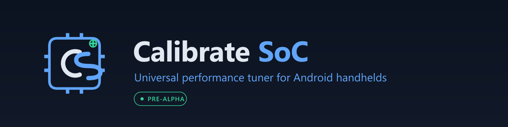
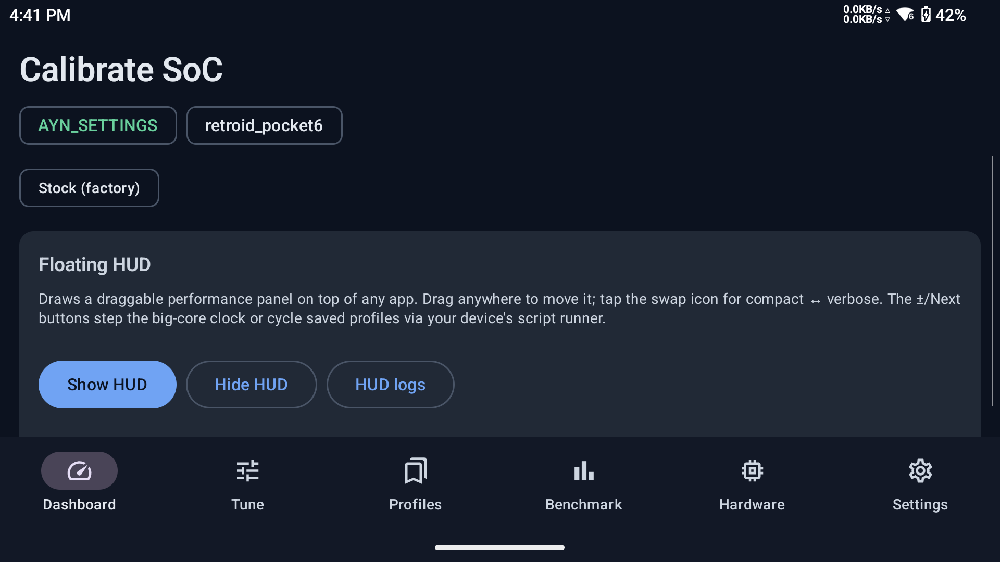
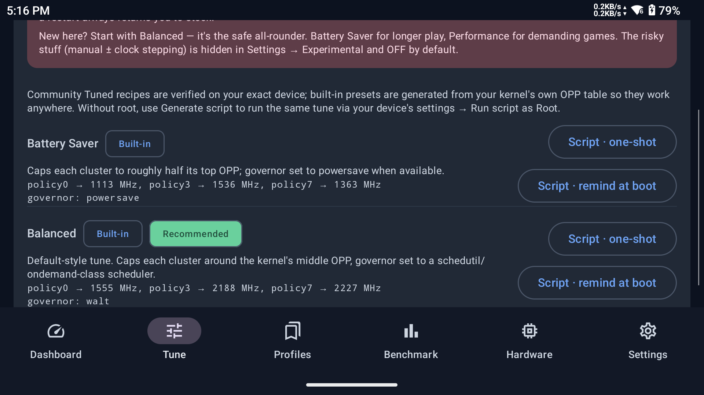
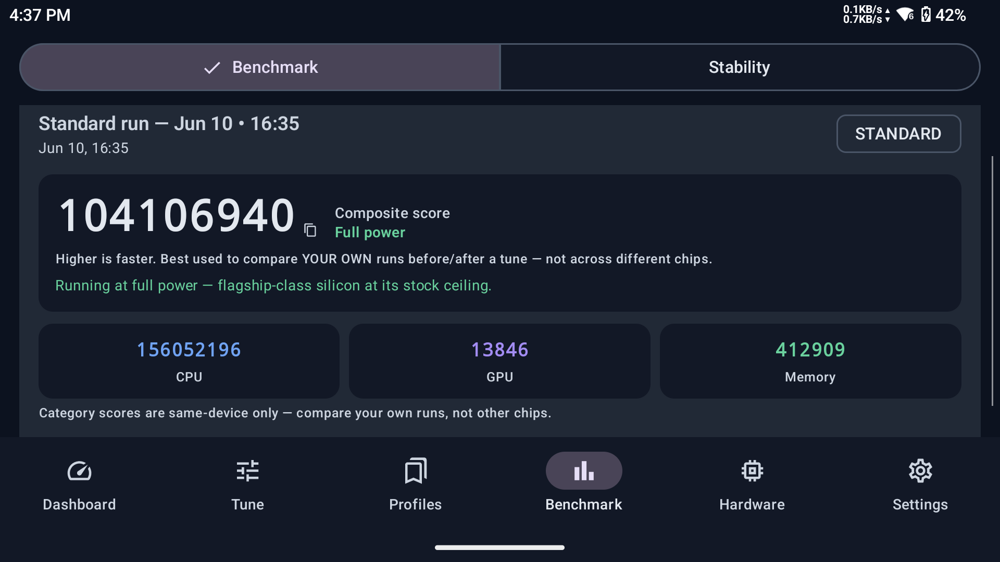
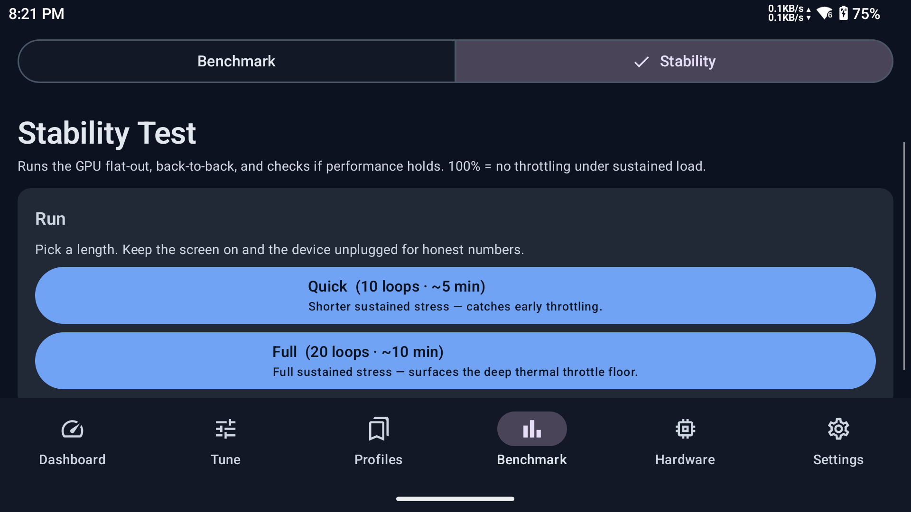
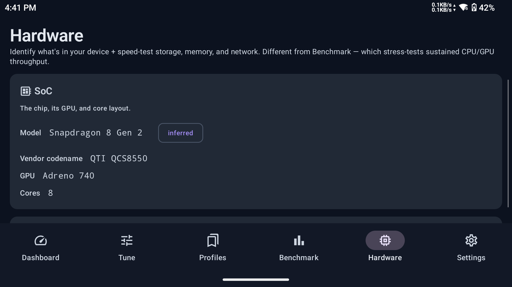
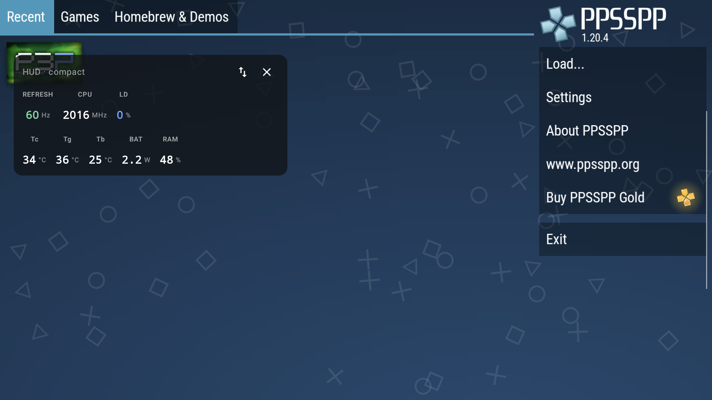
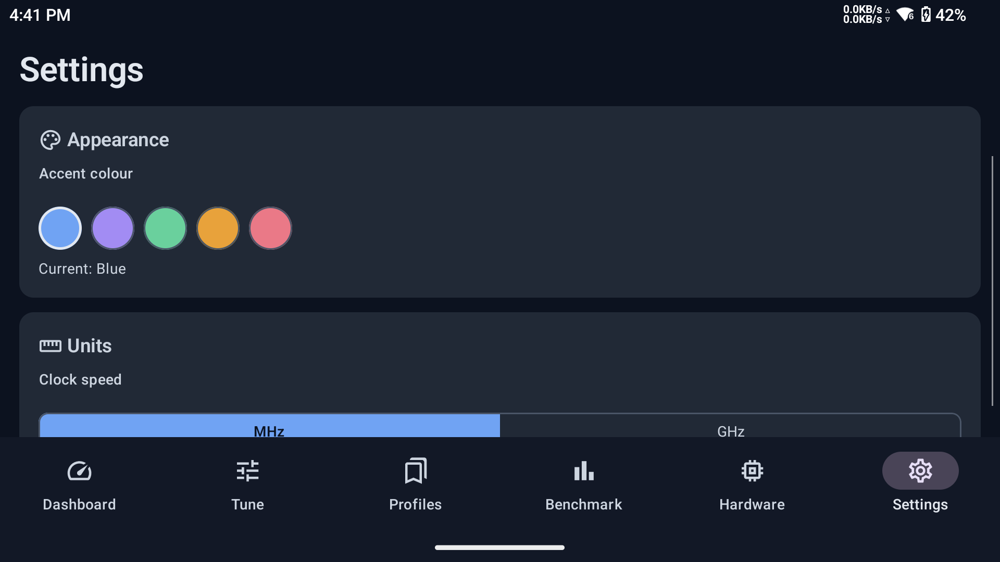
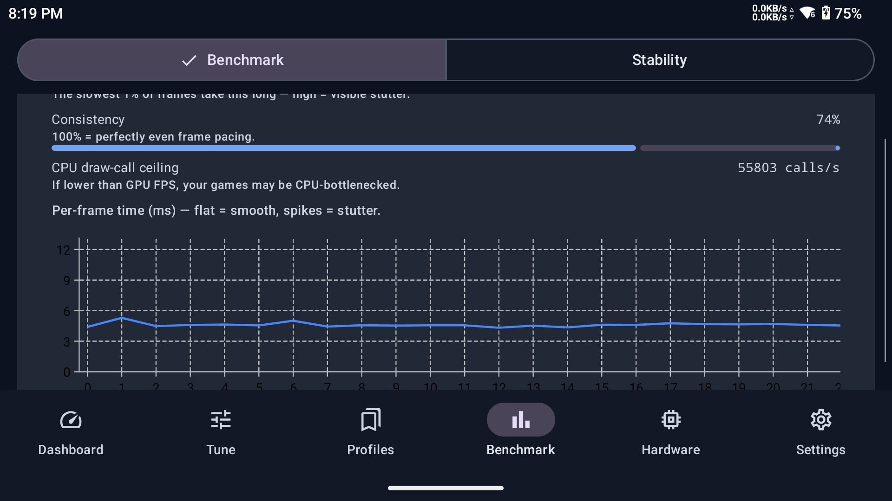
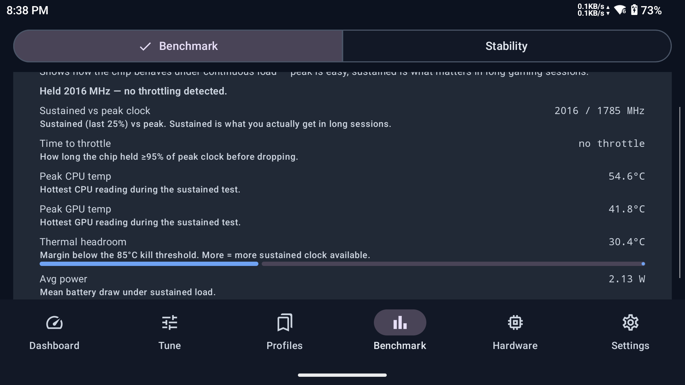

<p align="center"></p>

<div align="center">

**SoC tuning, adaptive performance governor, and live HUD for Android gaming handhelds.**

Real-time monitoring · Adaptive AutoTDP · per-game session history · live floating HUD · CPU/GPU/DDR tuning · benchmark suite · fan curves · zero-setup on AYN, Retroid, and AYANEO.

[](#project-status)
[](LICENSE)
[](#requirements)
[](#contributing)
[](https://github.com/mayusi/Calibrate-SoC/releases)
[](https://github.com/mayusi/Calibrate-SoC/releases)
[](https://github.com/mayusi/Calibrate-SoC/commits/main)

</div>

---

## Table of Contents

- [What it is](#what-it-is)
- [Supported devices](#supported-devices)
- [Download & install](#download--install)
- [Screenshots](#screenshots)
- [Features](#features)
- [How it works](#how-it-works)
- [Setup](#setup-first-launch)
- [Safety](#safety)
- [Requirements](#requirements)
- [Building from source](#building-from-source)
- [Contributing](#contributing)
- [Changelog](#changelog)
- [License](#license)

---

> ### ⚠️ Project status: alpha
> Calibrate SoC is under active development. Core features work and are tested daily on real hardware (AYN Odin 3, Retroid Pocket 6). Expect rough edges and breaking changes between versions. Bug reports and device-compatibility data are very welcome — see [Contributing](#contributing).

---

## What it is

Calibrate SoC is a SoC tuning and performance governor app for Android gaming handhelds. It learns how each of your games behaves over sessions and autonomously manages CPU, GPU, DDR, and fan speeds to hit your goal — smoother frames, cooler thermals, longer battery, or all three at once.

On **AYN Odin**, **Retroid Pocket**, and **AYANEO** handhelds it sets itself up in one tap by talking to the device's own built-in root bridge. No root, no PC, no scripts. On other devices it falls back to Shizuku or a manual root path.

Beyond the governor, the app covers monitoring, benchmarking, per-game session history, shareable tune codes, fan curves, and a live floating HUD over any game.

No telemetry. No accounts. No ads. Fully open source.

---

## Supported devices

| Device | SoC | Tuning access |
|--------|-----|---------------|
| AYN Odin 3 | Snapdragon 8 Gen 1 Leading Version | ✅ Zero-setup — verified daily |
| Retroid Pocket 6 | Snapdragon 8+ Gen 1 | ✅ Zero-setup — verified |
| AYANEO Pocket DS (and siblings) | Snapdragon 8 Gen 2 | ✅ Zero-setup — verified |
| AYN Thor | Snapdragon 8 Gen 2 Leading Version | ✅ Adapter present |
| AYN Odin 2 | Snapdragon 888 | 🟡 Adapter present, not yet hardware-verified |
| Retroid Pocket 5 | Snapdragon 778G+ | 🟡 Adapter present, not yet hardware-verified |
| Any Android 10+ device | — | ✅ Monitoring + benchmark (tuning via Shizuku or root) |

**Zero-setup** means one tap in the setup wizard grants everything via the device's vendor root bridge — no SELinux toggle, no script, no reboot. Full CPU/GPU/DDR/fan tuning is live immediately.

Have a device not listed? [Open a compatibility issue](https://github.com/mayusi/Calibrate-SoC/issues/new?template=device-compatibility.yml) or use the **Report unknown device** button in the Hardware tab.

---

## Download & install

Grab the latest APK from [Releases](https://github.com/mayusi/Calibrate-SoC/releases/latest) and sideload it. The app is **debug-signed** for alpha builds, which means any installed copy can receive in-app updates automatically — the in-app updater checks GitHub once a day and prompts you when a new version is out.

```bash
adb install -r CalibrateSoC-vX.Y.Z.apk
```

See [CHANGELOG](app/src/main/assets/changelog.md) for what changed in each release.

---

## Screenshots

<!-- Screenshot PNGs are added by the screenshot step. Until then these
     paths render as broken images in a local preview; they resolve once
     docs/assets/{dashboard,tune,benchmark,stability,hardware,hud-ingame}.png land. -->

<table>
  <tr>
    <td align="center" width="33%">
      <br>
      <sub><b>Dashboard</b> — per-core clocks, thermals, battery watts</sub>
    </td>
    <td align="center" width="33%">
      <br>
      <sub><b>Tunes</b> — AutoTDP, goal modes, manual controls</sub>
    </td>
    <td align="center" width="33%">
      <br>
      <sub><b>Benchmark</b> — honest self-relative scoring</sub>
    </td>
  </tr>
  <tr>
    <td align="center" width="33%">
      <br>
      <sub><b>Stability</b> — sustained GPU throttle curve</sub>
    </td>
    <td align="center" width="33%">
      <br>
      <sub><b>Hardware</b> — SoC, memory, storage, battery</sub>
    </td>
    <td align="center" width="33%">
      <br>
      <sub><b>HUD in-game</b> — live FPS, temps, clocks over any game</sub>
    </td>
  </tr>
  <tr>
    <td align="center" width="33%">
      <br>
      <sub><b>Settings</b> — accent colours, units, backup & updates</sub>
    </td>
    <td align="center" width="33%"></td>
    <td align="center" width="33%"></td>
  </tr>
</table>

### Detailed benchmark output

<table>
  <tr>
    <td align="center" width="50%">
      <br>
      <sub><b>GPU detail</b> — 1% low FPS, frame-time consistency, per-frame curve</sub>
    </td>
    <td align="center" width="50%">
      <br>
      <sub><b>Power & thermals</b> — sustained clocks, watts, energy, thermal headroom</sub>
    </td>
  </tr>
</table>

---

## Features

### 🤖 Adaptive AutoTDP (the core)

AutoTDP is a goal-seeking governor that tunes CPU, GPU, and DDR in real time to hit whichever goal you pick — then gets smarter the more you play.

**Goal modes:**
- **Balanced** — the default; holds the knee between smoothness and efficiency
- **Max FPS** — runs as hard as thermals allow
- **Cool & Quiet** — prioritises thermals and battery, backs off early
- **Battery Saver** — enforces a hard power ceiling; uses your actual battery capacity to target a runtime
- **Temperature Ceiling** — keep the die below a target temp, regardless of load
- **FPS Floor** — find the lowest-power point that still hits your target frame rate
- **Battery Runtime** — "make it last 3 hours"
- **AUTO** — adapts based on charging state, battery level, and game load; switches goal automatically

**What it learns:** AutoTDP remembers each game's safe sustained clock and throttle patterns. On repeat sessions it pre-sets a good starting point and heads off throttling before it happens. Cold-start behaviour is unchanged; it only uses learned data once it has real sessions to draw from.

**Safety:** a hard floor prevents AutoTDP from collapsing the CPU mid-game; reverts always run to completion even on fast app-switch or shutdown.

### 🎮 Per-game Insights

- **Session history** — real graphs of FPS, temps, power, and load across your sessions per game, with a Thermal Event Timeline showing exactly when the device throttled and how it lined up with frame drops.
- **Best-for-this-game** — the app shows the profile your own sessions proved best (with evidence: avg FPS, throttle count, session count) and applies it in one tap.
- **Per-app auto-profiles** — bind a goal mode + profile to a game; AutoTDP switches automatically when that game comes to the foreground.
- **Shareable game-tune codes** — share a whole game setup (profile + AutoTDP goal + refresh rate + fan + boost) as a short code. Imported codes are validated before anything is applied.

### ⚡ Game Boost and Throttle Guard

- **Game Boost** — applies max performance for the opening seconds of a game while things load, then AutoTDP takes over.
- **Predictive Throttle Guard** — detects impending thermal throttle and pre-emptively backs off one step to keep frames smooth. Both always restore your clocks when they stop — they cannot leave your clocks pinned.

### 📊 Live Dashboard

- Per-core CPU MHz sparklines — every core, every cluster
- GPU load, clock, and frequency table
- Every thermal zone the kernel exposes
- RAM usage, battery power draw (W), fan RPM where readable
- Battery time estimate ("~3h 10m remaining at 8.4 W") — honest, updates live, shows nothing when it can't measure

### 🎚️ Tunes — manual control

- Use-case presets (Cool & Quiet / Light Emulation / PS2-GameCube Sustained / Switch-Heavy / Anti-Throttle Sustained / Stock) derived from your kernel's actual OPP table — no hardcoded clock tables
- Verified community presets for Odin 3, Retroid Pocket 6, and Thor — delivered over the live content channel without an app update
- Manual GPU clock lock (floor and ceiling in real MHz)
- Per-cluster CPU governor tuning
- Display refresh-rate switcher (60 / 90 / 120 / 144 Hz where the panel supports it)
- Advanced kernel controls: CPU governor tunables, scheduler boost (schedtune/uclamp), input boost, memory/DDR bus, I/O scheduler, VM tweaks, and a custom-rule editor — all risk-labelled, validated, and reverting on reboot
- **Tunes survive reboot** — mark any tune "Apply on boot" and it re-applies every restart, zero action required

### 🎮 Floating HUD Overlay

- Compact horizontal strip with boxed cells (FPS · CPU · GPU · BAT) — readable at a glance over any game
- Switchable to a verbose scrollable panel
- Real in-game FPS via the display-rate path (works for Vulkan emulators)
- Per-core load + MHz, all thermals, live battery watts
- Drag anywhere; remembers last position between sessions
- Toggle from a Quick Settings tile or the Dashboard

### 🌀 Fan Curves

- **AYN Odin 3** — custom temp→fan% curves (presets or draw your own), driven via the vendor's own system service; hard anti-overheat floor (≥45% by 95°C)
- **Retroid Pocket 6** — custom fan speed via the Retroid system service, zero setup (experimental while device feedback is gathered)
- **AYANEO** — custom fan curves via the AYANEO system overlay, zero setup; same anti-overheat floor

### ⚡ Benchmark

- **Quick** (~20 s) — CPU integer single-thread
- **Standard** (~1 min) — CPU integer + float + AES + multi-thread + RAM bandwidth + GPU + draw-call ceiling
- **Full** (~3 min) — Standard plus a sustained throttle test
- Honest self-relative rating ("running at this chip's ceiling" vs "tuned down to ~68%") — never a fake cross-device score
- Bottleneck diagnosis: CPU-bound, GPU-bound, or thermal-throttled — and which tune helps
- Side-by-side A/B comparison of any two runs with overlaid throttle curves
- Benchmark trends over time (Overall / CPU / GPU / Memory)
- Stops if your battery gets genuinely low (under 15%, not charging) or too hot

### 🔥 Stability Test

- Sustained CPU + GPU simultaneous load (devices reach realistic ~95°C, fans ramp)
- Stability % = lowest loop FPS ÷ highest loop FPS
- Per-loop FPS curve, thermal/throttle curve, and peak temperature

### 🔎 Hardware Inspector

- SoC family, friendly name, GPU, and core topology
- Memory type (LPDDR5/5X) and storage class/vendor (UFS), with device-model fallback when sysfs is restricted
- Display, battery (design capacity, health), radios
- One-shot speed tests: sequential R/W, random 4K IOPS, RAM bandwidth, network
- Baseline Degradation check: compares your device now against its factory baseline (reports honestly when baseline data is insufficient)

### 🔋 Battery & Thermal Intelligence

- Live "how long will this last" estimate at current draw
- "°C until throttle" headroom gauge
- Temperature alerts — notify (or auto-switch to a cooler profile) when the device crosses a temperature you set
- Charging auto-profile — plug in while not gaming → cool/quiet mode, reverts on unplug

### 📜 History & Logs

- **Tune History** — persistent log of every preset/script/vendor write, with the pathway used
- **Gaming session recorder** — record a session, review FPS/temps/clocks/power over time afterward; Thermal Event Timeline highlights throttle episodes
- **Per-app Performance Dashboard** — sessions grouped by game with avg FPS, peak temperature, and avg power

### ⚙️ App management

- **In-app updater** — checks GitHub once a day; download and install without leaving the app (system installer handles the final confirm). Verifies every APK is signed by the same key before installing.
- **OTA content channel** — new device support and community presets arrive without a full app update
- **Backup & restore** — export all profiles, settings, and tune history to a file; import it back
- Accent colour picker (blue / purple / emerald / amber / rose), units (MHz/GHz, °C/°F), dark theme

---

## How it works

### The vendor root bridge

On AYN Odin and Retroid Pocket handhelds, the device manufacturer ships a privileged system binder service ("PServerBinder") that can write performance kernel nodes as root. Calibrate SoC discovers this service and uses it directly — no shell root, no Magisk, no Shizuku required. AYANEO handhelds expose an equivalent binder via their own system overlay.

Because this bridge was designed for the manufacturer's own apps, it is always available on supported handhelds and requires no user setup. The setup wizard's "one-tap setup" grants the app everything it needs (FPS counter, overlay, usage access, battery exemption, notifications) in a single transaction.

On other devices the app falls back in priority order: Shizuku (shell-tier), libsu root, or a script-generator (generate a `.sh`, run it via your device's "Run as Root" flow).

### The safety guard (PServerCommandGuard)

Every command the app sends through the root bridge passes a strict default-deny guard before it is executed. The guard only permits writes to known-safe performance nodes and diagnostic reads. Destructive operations — delete, format, partition, bind/unbind drivers, sysrq, SELinux mode changes, power/suspend — are categorically blocked regardless of what path is passed, including through imported or community content. This is enforced at a single chokepoint and covered by tests.

### Honesty discipline

Measured, learned, and estimated values are clearly distinguished throughout the app. If a write is not confirmed by a readback, it is not marked as success. If a capability is not available on your device, the app says so instead of silently failing or faking a result.

---

## Setup (first launch)

A short wizard runs the first time you open the app. On supported handhelds (Odin, Retroid, AYANEO) the wizard detects the vendor bridge and shows **"You're all set — live tuning is active."** One tap grants everything.

On other devices, the wizard walks through:

1. **Draw over other apps** — for the floating HUD
2. **Usage access** — so the HUD knows which game is in front
3. **Ignore battery optimization** — keeps the monitor alive during long sessions
4. **Optional: Shizuku or root** — for live clock writes outside the zero-setup path

Everything is re-checkable and re-grantable from the **Settings** tab at any time.

---

## Safety

- Every tunable is **snapshotted before it's written** and reverted on reboot unless you explicitly mark it "Apply on boot".
- A **Restore stock** action rolls back to the factory baseline at any time.
- All root commands pass the **PServerCommandGuard** — a default-deny allowlist that blocks destructive operations categorically.
- Stress tests have a hard time cap, a thermal kill switch (default 85°C SoC), and stop if your battery gets too low.
- The preset generator refuses unsafe configs (e.g. `min == max`, or a min clock that would prevent idle).
- In-app updates are verified against the installed APK's signing certificate before installation is offered.
- This app is **alpha** — use it on a handheld gaming device you are comfortable experimenting on.

---

## Requirements

- Android 10 (API 29) or newer
- arm64-v8a (every supported handheld qualifies)

---

## Building from source

Requires JDK 17, Android SDK 35, NDK (CMake 3.22.1+). Kotlin 2.x (via version catalog).

```bash
git clone https://github.com/mayusi/Calibrate-SoC.git
cd Calibrate-SoC
./gradlew assembleDebug        # debug APK (debug-signed, can receive in-app updates)
./gradlew assembleRelease      # release APK (debug-signed unless keystore.properties present)
```

The APK lands at `app/build/outputs/apk/debug/app-debug.apk`. Sideload with `adb install -r <apk>`.

Release builds are debug-signed unless a `keystore.properties` is present at the project root (gitignored — signing keys never enter the repo).

---

## Contributing

Calibrate SoC actively welcomes contributions. See [CONTRIBUTING.md](CONTRIBUTING.md) for detailed guidelines:

- **Bug reports** — open an issue with your device, Android version, and steps to reproduce.
- **Device compatibility** — got a handheld not listed above? Use the **Report unknown device** button in the Hardware tab to generate a pre-filled report. This is the most valuable contribution right now.
- **Pull requests** — device adapters, bug fixes, UI polish, and new presets are all welcome. Please keep PRs focused and describe what you tested on.
- **Ideas** — feature requests and design feedback via issues.

There's no CLA and no bureaucracy.

---

## Changelog

See the [in-app changelog](app/src/main/assets/changelog.md) for the full release history.

---

## License

[Apache-2.0](LICENSE) — permissive, with an explicit patent grant. No warranty.

## Credits

**Community tuners & inspiration**
- [**TheOldTaylor**](https://github.com/TheOldTaylor/Odin3-CPU-Underclock) — Odin 3 community underclock values bundled as "Community Tuned" presets (original discoverers u/twoohfive205 and u/JoaozaoS, credited in that repo).
- [**langerhans / OdinTools**](https://github.com/langerhans/OdinTools) — reference for the vendor Settings-key and per-app-switch patterns (no code copied).
- **SmartPack-Kernel-Manager** — read for reference only; no code copied.

**Open-source libraries** — Jetpack Compose & Material 3, Hilt, Room, DataStore, Kotlin Coroutines, kotlinx.serialization, OkHttp, Okio, Vico Charts, Shizuku, libsu. (All Apache-2.0.)

**Development tooling** — parts of this codebase were written with the help of AI coding assistants under human direction, review, and on-device testing. These are tools that assisted the work — not authors or maintainers — and the project's direction, testing, and final decisions are human.

Full attribution and license details: [CREDITS.md](CREDITS.md).
