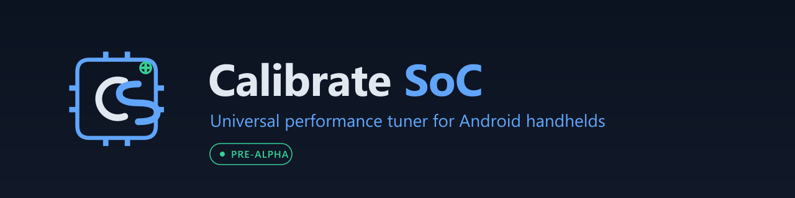
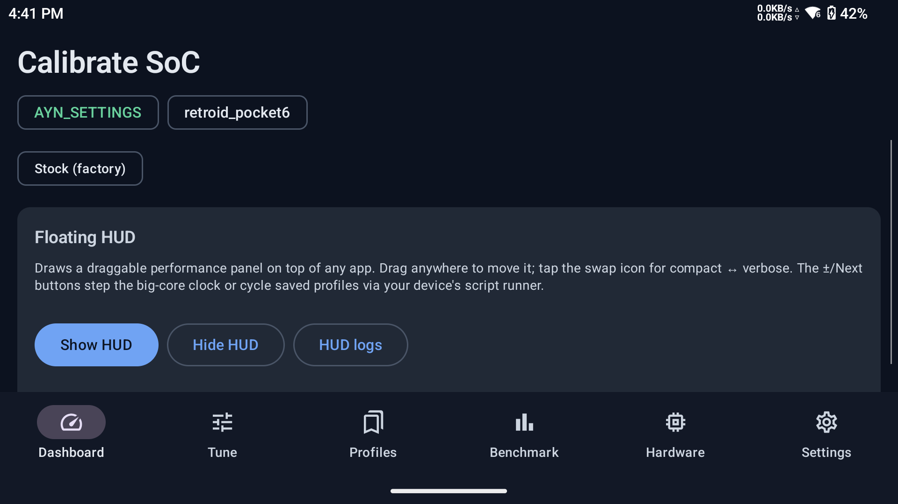
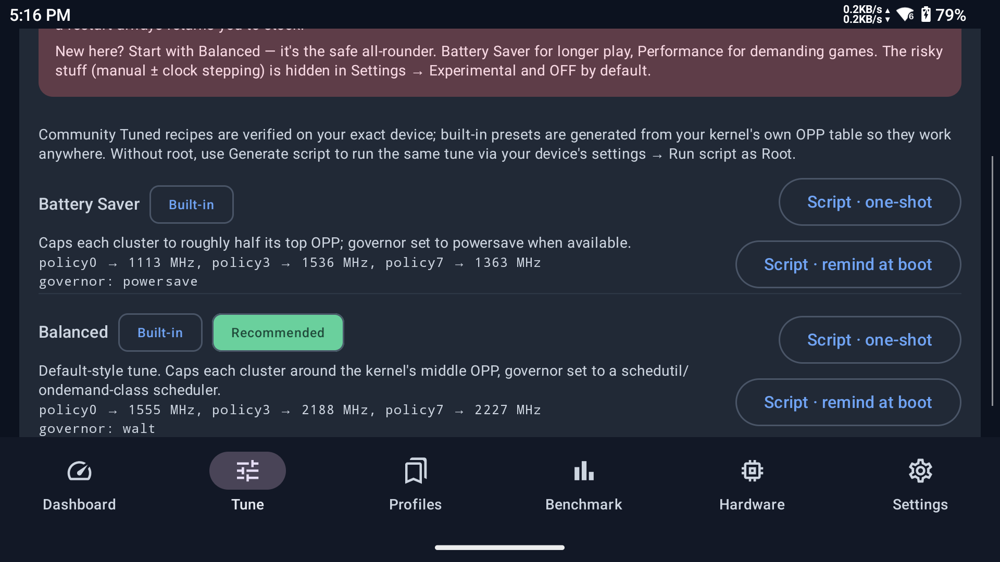
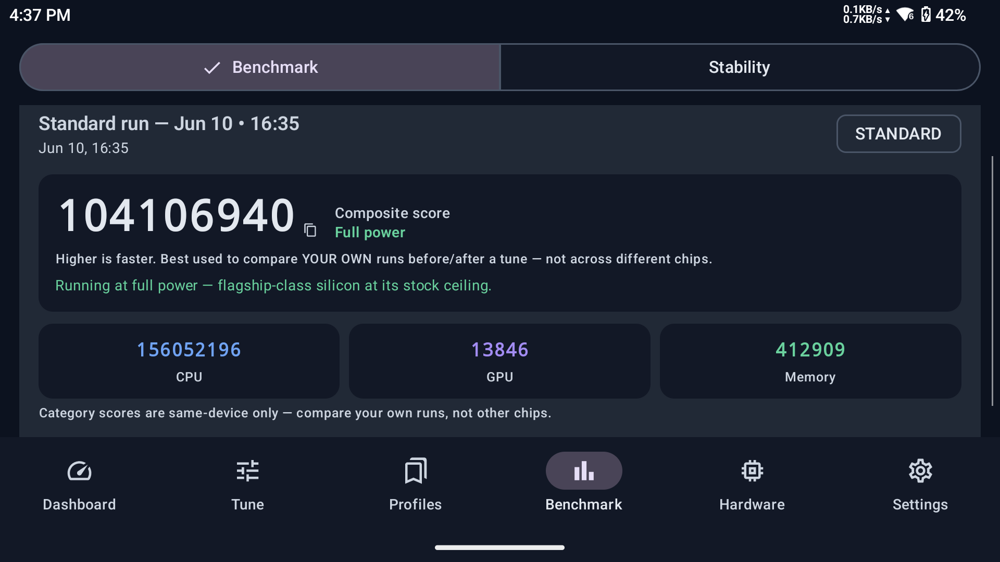
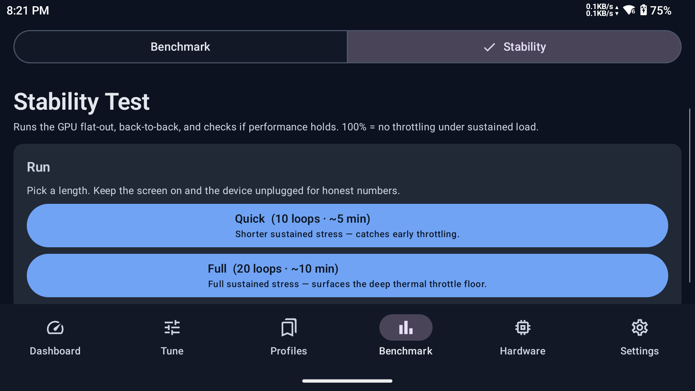
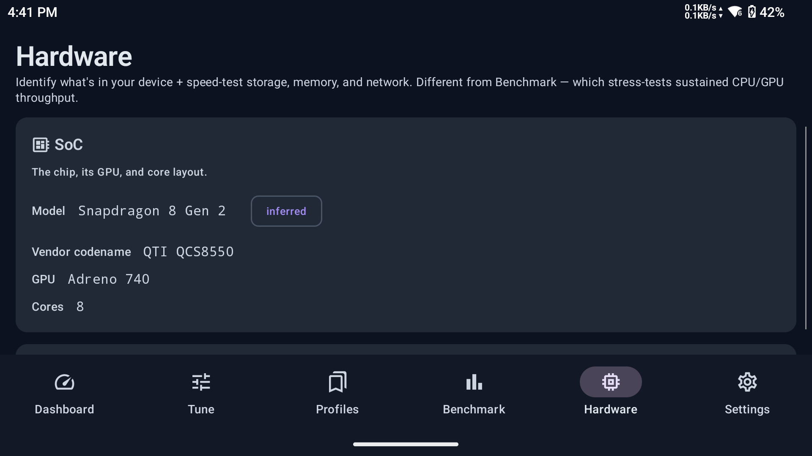
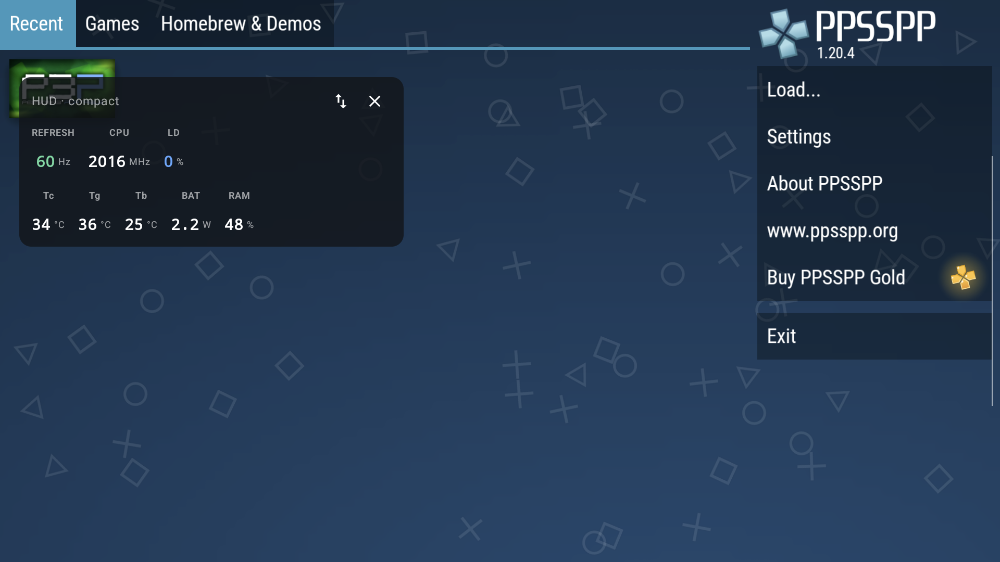
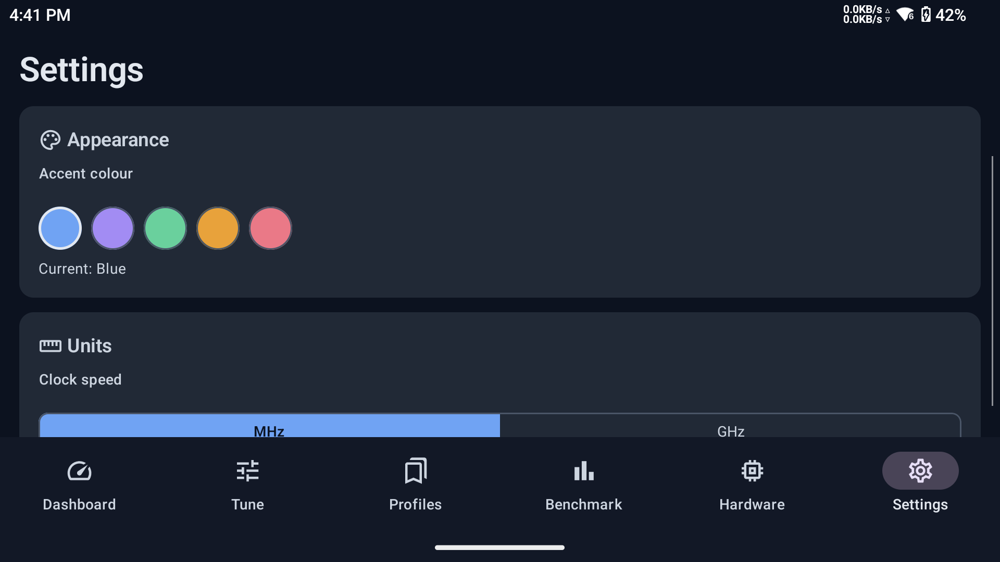
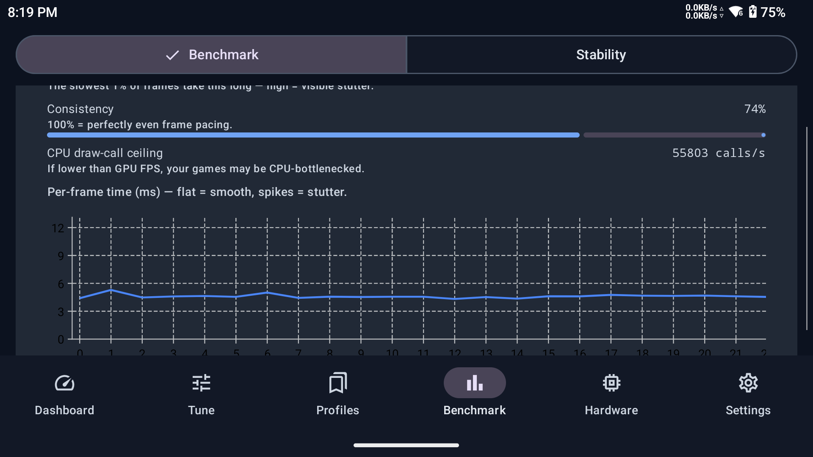
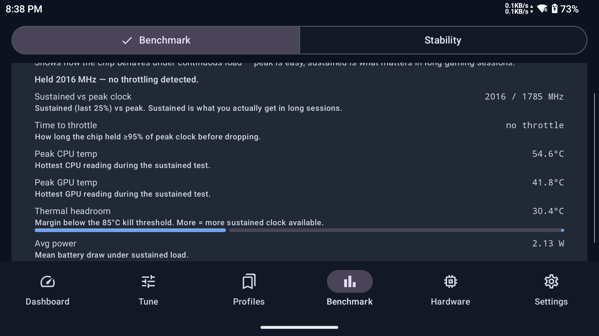

<p align="center"></p>

<div align="center">

**Zero-setup SoC tuning, a goal-seeking performance governor, and a live HUD for Android gaming handhelds.**

Real-time monitoring · goal-seeking AutoTDP governor · whole-SoC Adaptive governor · per-game learning · native benchmark suite · fan curves · live floating HUD — with no root, no PC, and no Shizuku on supported handhelds.

[](#what-it-is)
[](LICENSE)
[](#supported-devices)
[](#contributing)
[](https://github.com/mayusi/Calibrate-SoC/releases)
[](https://github.com/mayusi/Calibrate-SoC/releases)
[](https://github.com/mayusi/Calibrate-SoC/commits/main)

</div>

---

## Table of Contents

- [What it is](#what-it-is)
- [Why it exists](#why-it-exists)
- [Supported devices](#supported-devices)
- [Zero-setup, explained](#zero-setup-explained)
- [Features](#features)
- [Verified on real hardware](#verified-on-real-hardware)
- [Screenshots](#screenshots)
- [Download & install](#download--install)
- [Setup per tier](#setup-per-tier)
- [How it works](#how-it-works)
- [Tech stack](#tech-stack)
- [Building from source](#building-from-source)
- [Contributing](#contributing)
- [Credits](#credits)
- [License](#license)

---

> ### Project status: alpha (v0.3.9-alpha)
> Calibrate SoC is under active development. The core is real and tested daily on real hardware (AYN Odin 3, Retroid Pocket 6, AYANEO Pocket DS), with ~2,900 automated tests. Expect rough edges and the occasional breaking change between versions. Bug reports and device-compatibility data are very welcome — see [Contributing](#contributing).

---

## What it is

Calibrate SoC is a performance-tuning and monitoring app for Android gaming handhelds — the AYN Odin, Retroid Pocket, and AYANEO families.

On supported handhelds it tunes the chip **live, in one tap** — no root, no PC, no Shizuku — by talking to each vendor's own privileged bridge. From there it gives you:

- **Real-time monitoring** of every core, clock, thermal zone, watt, and fan, plus a draggable in-game HUD.
- **AutoTDP** — a goal-seeking, utilization-band governor that hunts the lowest-power operating point which still keeps your game smooth. It is not a set of presets; it actively closes a control loop every tick.
- **Adaptive** — a separate whole-SoC governor that tunes CPU clocks + governor, a GPU governor, GPU overclock, and memory bias together from a single dial.
- **Per-game intelligence** — session history, a learned model of each game's safe sustained clocks, auto-switching per-app bundles, and shareable tune codes.
- **A native benchmark suite**, **fan-curve control**, and **manual kernel tuning** for people who want the knobs.

No telemetry. No accounts. No ads. Kotlin/Compose, Apache-2.0, fully open source — `mayusi/Calibrate-SoC`.

---

## Why it exists

Handhelds throttle. A phone SoC crammed into a 5-inch gaming device with a small battery and a passive-or-tiny fan will happily boost to full clocks, cook itself in two minutes, and then spend the rest of your session bouncing off a thermal limit — with the frame drops that come with it. Stock firmware either lets it run hot or caps it bluntly.

Calibrate SoC's job is to *tame the chip*: keep the GPU fed, hold the CPU only as high as the game actually needs, stay under a thermal ceiling, and stretch battery — automatically, and per-game. It measures instead of guessing, and it tells you honestly when it can't do something on your device rather than faking a result.

---

## Supported devices

The tuning-access column is what actually matters: **Zero-setup** means live tuning works the instant you open the app, with no root, no PC, and no Shizuku.

| Device | SoC | Qualcomm model | GPU | Tuning access | Status |
|---|---|---|---|---|---|
| **AYN Odin 3** | Snapdragon 8 Elite (Dragonwing) <sup>[1](#fn1)</sup> | SM8750 (`sun`) | Adreno 830 | Zero-setup (PServer bridge) | ✅ Verified daily |
| **Retroid Pocket 6** | Snapdragon 8 Gen 2 | SM8550 / QCS8550 (`kalama`) | Adreno 740 | Zero-setup (PServer bridge) | ✅ Verified |
| **AYANEO Pocket DS** | Snapdragon G3x Gen 2 <sup>[2](#fn2)</sup> | SG8275 | Adreno (G-series) | Zero-setup (vendor binder) | ✅ Verified |
| **AYN Thor** | Snapdragon 8 Gen 2 | SM8550 / QCS8550 (`kalama`) | Adreno 740 | Adapter present | 🟡 Not yet HW-verified |
| **AYN Odin 2** (+ Mini / Portal) | Snapdragon 8 Gen 2 | SM8550 (`kalama`) | Adreno 740 | Adapter present | 🟡 Not yet HW-verified |
| **Retroid Pocket 5** | Snapdragon 865 | SM8250 (`kona`) | Adreno 650 | Adapter present | 🟡 Not yet HW-verified |
| Any other Android arm64 device | — | — | — | Monitoring + benchmark; tuning via Shizuku, root, or a generated script | ⚪ Fallback path |

<sub><a name="fn1">1.</a> The Odin 3's chip launched marketed as **"Snapdragon 8 Elite"**; roughly six months later Qualcomm asked AYN to rename it **"Dragonwing Q8"** — same **SM8750** silicon either way. It is a **2-cluster** part (`policy0` = 6 cores, `policy6` = 2 prime cores), **not** the 3-cluster phone layout. It is **not** an 8 Gen 1 or 8 Gen 2.</sub>
<br><sub><a name="fn2">2.</a> The AYANEO Pocket DS uses Qualcomm's **G3x Gen 2 gaming platform (SG8275)** with a G-series Adreno — a separate product line from the phone **Snapdragon 8 Gen 2 (SM8550)**. They are not the same chip; don't conflate them.</sub>

Have a device that isn't listed? Use the **Report unknown device** button in the Hardware tab (it generates a pre-filled report), or [open a compatibility issue](https://github.com/mayusi/Calibrate-SoC/issues/new?template=device-compatibility.yml). Device-compat data is the single most useful contribution right now.

---

## Zero-setup, explained

Most Android tuning tools want root, or a PC + `adb`, or a Shizuku pairing dance before they can write a single kernel node. On supported handhelds, Calibrate SoC needs **none of that**.

Each of these vendors ships a privileged system service — designed for the manufacturer's own Game Assistant / performance app — that can write the performance kernel nodes as root. Calibrate SoC discovers that service and routes its writes through it:

- **AYN Odin & Retroid Pocket** — a system binder the community calls **PServerBinder** runs commands as `uid=0`. No Magisk, no KernelSU.
- **AYANEO** — the `com.ayaneo.gamewindow` overlay exports an unguarded AIDL service; the overlay (running as `system`) does the privileged sysfs write on the app's behalf.

The result: open the app on an Odin 3, and live tuning is *already active* before you touch anything. The setup wizard confirms it and grants the handful of Android permissions the HUD needs (overlay, usage access, battery exemption) in one tap.

On any other device the app falls back honestly: **Shizuku** → **root** (Magisk / KernelSU) → **generate a script** you run through your device's own root flow. If none is available you still get full monitoring and benchmarking.

---

## Features

### Real-time monitoring + floating HUD



- Per-core CPU MHz (every core, every cluster), GPU load and clock, **every thermal zone the kernel exposes**, RAM, battery power draw in watts, and fan RPM/duty where readable.
- **Floating HUD overlay** — a real system overlay over any game, in two modes: a **compact** always-on strip (FPS · CPU · GPU · BAT) and a **verbose** expandable card with per-core load/MHz, all thermals, and live watts. Draggable, and it remembers its position.
- **Per-game FPS sampling** via the display-rate path — works with Vulkan emulators and Winlator.
- **Session recorder** with a **thermal-event timeline** that lines up throttle episodes against frame drops.
- Honest battery estimate ("~3h 10m at 8.4 W") that shows nothing when it genuinely can't measure.

<br clear="right">

### AutoTDP — the goal-seeking governor (flagship)

AutoTDP is not a preset picker. It is a **utilization-band controller**: each tick it reads GPU busy%, compares it to a per-goal target band, and hunts the **lowest-power operating point that still keeps the GPU inside that band** — so you keep the frames you'd otherwise throw away, and spend nothing extra when the game doesn't need it.

**8 goal modes:**

| Mode | What it targets |
|---|---|
| **Max FPS** | 70–95% GPU band — run hard, never bottleneck the GPU |
| **Balanced Smart** *(default)* | 63–85% band — the knee between smoothness and efficiency |
| **Cool & Quiet** | 48–70% band — pre-emptively backs off for heat and noise |
| **Battery Saver** | 35–60% band with a hard watts ceiling |
| **Auto** | Reads context (charge state, battery level, load) and picks a goal each tick |
| **Target Temp Ceiling** | Hold the die at/under a °C you set, regardless of load |
| **Target FPS Floor** | Find the cheapest point that still holds ≥ N fps |
| **Target Runtime** | "Make it last H hours" — a ~60-second-budget runtime controller sized to your real battery capacity |

**Levers it pulls** (in a per-goal order): CPU cluster frequency cap, min-freq floor, GPU devfreq / floor, core parking, and uclamp performance hints.

**Safety:** a **40% hard cap floor** so it can never collapse the CPU mid-game; a **thermal kill** (~95–105 °C, multi-sample debounced, watching *all* zones); a **battery-low kill**; and reverts that **always run to completion** — even on a fast app-switch or an app kill.

### Non-interference back-off (0.3.7–0.3.9)

AutoTDP **stands fully down** — reverts to stock, then auto-resumes — whenever another app is the one running your performance, so it never fights your game runtime. It detects that in several ways:

- A **known game runtime** (Nova / GameNative) or **Winlator** in the foreground.
- **Any unknown tuner**, detected *generically*: a foreground app that holds `WRITE_SECURE_SETTINGS` **and** is actively overriding the clocks right now (a permission ordinary games, browsers, and launchers never have — and the "actively overriding" requirement means an automation app you merely granted it to won't trip it).
- **Sysfs contention** — a sustained tug-of-war on the clocks (a one-off kernel adjustment is ignored).
- An **untuned foreground game** you haven't set up a profile for — it stays stock rather than guessing.

The back-off is primarily automatic and foreground-driven; a manual "another app in control" pause also exists. Whenever it's paused, the screen shows **"Suspended — …"** with the reason, so it's never a mystery.

### GPU-max policy (0.3.8)

GPU clock barely moves the battery needle, so capping it down just costs frames for nothing. AutoTDP and Adaptive now **keep the GPU high** and do all power management on the **CPU / TDP** side. Thermal safety still trims the GPU on genuine heat, and there's an **opt-in switch** to restore old-style GPU power-capping if you want it.

### Adaptive — the whole-SoC governor (separate flagship, 0.3.0)



One dial tunes the **entire chip** at once. Pick from **5 presets** — Max Performance → Performance → Balanced → Efficiency → Max Battery — or set **custom weights** across performance / battery / stability / thermal.

- **GPU overclock tiers:** **OFF** · **Within-Vendor** (safe — hold the vendor's own top clock) · **Beyond-Stock** (experimental — live-probed for kernel acceptance, and guarded by a per-tick thermal guard).
- A **coordinator** resolves CPU clocks + governor, a GPU governor, GPU overclock, and memory bias in a single loop, with two-sided logic (it will *loosen* as readily as it tightens).

<br clear="right">

### Per-game intelligence

- **Per-app bundles** — bind a tune (goal mode + profile + refresh rate + fan + boost) to a game; it auto-switches when that game comes to the foreground.
- **Session history graphs** — FPS / temp / power over time, with an honest "saved X% battery" readout.
- **A learned model** — remembers each game's safe sustained clocks and pre-sets a good starting point on repeat sessions, heading off throttling before it happens.
- **"Best for this game"** — recommends the profile *your own sessions* proved best, with the evidence (avg FPS, throttle count, session count).
- **KnownGames auto-config** — classifies emulators and launchers into tiers automatically.
- **Shareable tune codes** — export a whole game setup as a short code; imported codes are validated before anything is applied.

### Zero-setup device tiers

Privilege is resolved to one of **ROOT / SHIZUKU / VENDOR_SETTINGS / NONE**, and grants reflect **within ~2 s live, no restart** (0.3.7):

- **PServerBinder** — the AYN / Retroid vendor root bridge (no root, no PC, no Shizuku).
- **AYANEO vendor binder** — plus **performance-mode CPU tuning**: because AYANEO rejects raw cpufreq writes from the app UID, Calibrate drives the vendor's own **save / balanced / game / firepower / streaming** modes instead, and **self-heals to stock** if the app ever crashes.
- **Shizuku**, **root** (Magisk / KernelSU, opt-in), or a **generate-a-script** path for anything else.

### Fan control

- **AYN Odin 3** — temp→fan% curves via the vendor key, with a hard **anti-overheat floor** (≥45% @ 95 °C, ≥60% @ 105 °C).
- **Retroid Pocket 6** — fan speed via the vendor binder (verified on-device).
- **AYANEO** — temp→fan% curves via the vendor overlay, same anti-overheat floor. A curve can never be set low enough to overheat the device.

### Benchmarks



A native **C++ (NDK)** engine, in three depths:

- **Quick** (~20 s) · **Standard** (~1 min) · **Full** (~3 min: CPU int/float/AES/multi-thread, RAM bandwidth, GPU, draw-call ceiling, and a sustained throttle test).
- **Honest self-relative scoring** — measured against *this chip's own ceiling*, never a fake cross-device number.
- **Bottleneck diagnosis** (CPU-bound / GPU-bound / thermal-throttled) with which tune helps.
- **A/B compare** of any two runs with overlaid throttle curves, plus trends over time.
- A **stability test** — simultaneous sustained CPU + GPU load, reported as a stability %.

<br clear="right">

### Manual tuning

For people who want the knobs directly: **CPU / GPU / DDR MHz caps, governors, per-core on/off, scheduler / uclamp / input-boost, I/O scheduler, and VM tweaks** — every control **risk-labelled**, **validated**, **reverted on reboot**, and optionally **applied on boot**.

- **Presets from the real OPP table** (Cool & Quiet / Light Emulation / PS2-GameCube Sustained / Switch-Heavy / Anti-Throttle / Stock) — derived from the kernel's actual operating points, not a hardcoded clock list.
- **Community / OTA presets** delivered over the live content channel without an app update (the Odin 3 ships TheOldTaylor's underclock levels, attributed).

### Safety & the rest

- Onboarding wizard, in-app updater (**cert-pinned**, verifies the signing match before installing), changelog viewer, TalkBack accessibility, and full backup/restore.
- A **root-command safety gate** — a default-deny allowlist that categorically blocks `rm` / format / partition / reboot / driver-bind / SELinux-mode / suspend at a **single chokepoint**, regardless of what path is passed (including imported or community content). Enforced and covered by tests.

---

## Verified on real hardware

Everything below was captured on a real **AYN Odin 3** (v0.3.9-alpha, Snapdragon 8 Elite, Android 15). These are concrete values off the device, not marketing.

**Zero-setup is real.** Onboarding showed **"Live tuning (already active on this device)"** *before any tap*. Logcat: `CalibrateSoC-PServer: isTransactable() probe → true`, while a direct sysfs write returned `EACCES` — proving writes route through the vendor root bridge, with no Magisk. Tier badge: **"AYN LIVE — AYN_ODIN3"**.

**AutoTDP closes the loop live.** Engaging the **Battery** goal produced:

```
decision: tighten — big cap → 4204 MHz
policy6 scaling_max_freq: 4320000 → 3283200 kHz   (REDUCTION 32.7%)
```

…and on **Stop**:

```
stopDaemon revert: ok=4 failed=0
```

with sysfs back to exact factory (`4320000` / `3532800` / `1100000000`). The **GPU max held at `1100000000` Hz the entire time** — proving the GPU-max policy: the GPU is never power-capped.

**Hardware ID is accurate.** The app detected **Snapdragon 8 Elite**, **Adreno 830**, 8 cores, **16 GB LPDDR5X**, **UFS 4.0**.

**Adaptive runs two-sided.** With its 5 presets (Max Perf / Perf / Balanced / Efficiency / Max Battery), the coordinator logged: `CPU: holding (in band) · GPU: at ceiling (nothing to loosen)`.

**The HUD is a genuine overlay.** `dumpsys window` showed `ty=APPLICATION_OVERLAY appop=SYSTEM_ALERT_WINDOW`.

**Benchmark ran end-to-end.** A Quick run completed with a composite score of **63,144,690** and a bottleneck diagnosis.

**Fan reads live.** The Odin PWM reported **duty 57%**, raw **28500**, period **50000**.

---

## Screenshots

<table>
  <tr>
    <td align="center" width="33%">
      <br>
      <sub><b>Dashboard</b> — per-core clocks, thermals, battery watts</sub>
    </td>
    <td align="center" width="33%">
      <br>
      <sub><b>Tunes</b> — AutoTDP, goal modes, Adaptive, manual controls</sub>
    </td>
    <td align="center" width="33%">
      <br>
      <sub><b>Benchmark</b> — honest self-relative scoring</sub>
    </td>
  </tr>
  <tr>
    <td align="center" width="33%">
      <br>
      <sub><b>Stability</b> — sustained CPU+GPU throttle curve</sub>
    </td>
    <td align="center" width="33%">
      <br>
      <sub><b>Hardware</b> — SoC, memory, storage, battery</sub>
    </td>
    <td align="center" width="33%">
      <br>
      <sub><b>HUD in-game</b> — live FPS, temps, clocks over any game</sub>
    </td>
  </tr>
  <tr>
    <td align="center" width="33%">
      <br>
      <sub><b>Settings</b> — accent colours, units, backup & updates</sub>
    </td>
    <td align="center" width="33%">
      <br>
      <sub><b>GPU detail</b> — 1% low FPS, frame-time consistency</sub>
    </td>
    <td align="center" width="33%">
      <br>
      <sub><b>Power & thermals</b> — sustained clocks, watts, thermal headroom</sub>
    </td>
  </tr>
</table>

---

## Download & install

Grab the latest APK from [**Releases**](https://github.com/mayusi/Calibrate-SoC/releases/latest) and sideload it. Alpha builds are **debug-signed**, which is deliberate: it lets any installed copy receive **in-app updates** automatically — the updater checks GitHub about once a day, verifies the new APK is signed by the same key, and prompts you.

```bash
adb install -r CalibrateSoC-v0.3.9-alpha.apk
```

See the [in-app changelog](app/src/main/assets/changelog.md) for what changed in each release.

---

## Setup per tier

A short wizard runs on first launch.

**On supported handhelds** (Odin, Retroid, AYANEO) it detects the vendor bridge and shows **"Live tuning is already active."** One tap grants the Android permissions the HUD needs. That's it — full CPU/GPU/DDR/fan tuning is live immediately.

**On other devices**, the wizard walks you through:

1. **Draw over other apps** — for the floating HUD.
2. **Usage access** — so the HUD knows which game is in front.
3. **Ignore battery optimization** — keeps the monitor alive during long sessions.
4. **Optional: Shizuku or root** — for live clock writes outside the zero-setup path.

Everything is re-checkable and re-grantable from **Settings** at any time, and grants reflect live within ~2 s (0.3.7) — no restart.

---

## How it works

### The vendor bridges

On AYN and Retroid handhelds, the manufacturer ships a privileged system binder (**PServerBinder**) that can write performance kernel nodes as root — it exists for the vendor's own Game Assistant. Calibrate SoC discovers it and sends its writes through it directly: no shell root, no Magisk, no Shizuku. AYANEO exposes an equivalent path via the `com.ayaneo.gamewindow` overlay's exported AIDL service, which performs the privileged sysfs write as `system`.

Because these bridges were built for the vendor's own apps, they're always present on supported handhelds and need no user setup.

### The AutoTDP band controller

Each tick, AutoTDP reads **GPU busy%** and compares it against the active goal's target band. If utilization sits *above* the band, the GPU is starved and it **loosens** (raises the CPU cap / floor); if it sits *below*, there's slack and it **tightens** (lowers power) — always searching for the lowest-power point that keeps the GPU fed. It pulls CPU cap, min-freq floor, GPU devfreq/floor, core parking, and uclamp hints in a per-goal order, and it applies a 40% hard cap floor, a multi-sample thermal kill across all zones, and a battery-low kill on top. Under the **GPU-max policy**, the GPU is deliberately held high and power management is done on the CPU/TDP side. Reverts run under a non-cancellable path so they complete even if the app is killed mid-session.

### The Adaptive coordinator

Adaptive resolves the *whole SoC* in one loop from a single preset (or custom performance/battery/stability/thermal weights): CPU clocks + governor, a GPU governor, a GPU overclock tier (OFF / Within-Vendor / Beyond-Stock, the last live-probed for acceptance and thermally guarded), and memory bias. Its logic is two-sided — it loosens when there's headroom just as readily as it tightens under pressure.

### Honesty discipline

Measured, learned, and estimated values are distinguished throughout. If a write isn't confirmed by a readback, it is **not** marked a success. If a capability isn't available on your device, the app says so rather than silently failing or faking a number.

---

## Tech stack

- **Kotlin 2.x** + **Jetpack Compose** with **Material 3**
- **Hilt** (DI), **Room** (per-game history + learned model), **DataStore** (settings), **Kotlin Coroutines / Flow**
- **Native C++ / NDK** benchmark engine (CMake)
- **Shizuku** and **libsu** for the non-vendor privilege tiers
- **minSdk 29**, **targetSdk 35**, **arm64-v8a**

---

## Building from source

Requires JDK 17, Android SDK 35, and the NDK (CMake 3.22.1+). Kotlin 2.x via the version catalog.

```bash
git clone https://github.com/mayusi/Calibrate-SoC.git
cd Calibrate-SoC
./gradlew assembleDebug        # debug APK (debug-signed, can receive in-app updates)
./gradlew assembleRelease      # release APK (debug-signed unless keystore.properties present)
```

The APK lands at `app/build/outputs/apk/debug/app-debug.apk`. Sideload with `adb install -r <apk>`. Release builds are debug-signed unless a `keystore.properties` is present at the project root (gitignored — signing keys never enter the repo).

---

## Contributing

Contributions are genuinely welcome. See [CONTRIBUTING.md](CONTRIBUTING.md) for the details.

- **Device compatibility data is the most valuable thing right now.** Got a handheld that isn't verified above? Use the **Report unknown device** button in the Hardware tab to generate a pre-filled report — it's how the 🟡 entries become ✅.
- **Bug reports** — open an issue with your device, Android version, and steps to reproduce.
- **Pull requests** — device adapters, fixes, UI polish, and new presets are all welcome. Keep them focused and say what you tested on.
- **Ideas** — feature requests and design feedback via issues.

No CLA, no bureaucracy.

---

## Credits

**Community tuners & inspiration**
- [**TheOldTaylor**](https://github.com/TheOldTaylor/Odin3-CPU-Underclock) — Odin 3 community underclock values bundled as "Community Tuned" presets (original discoverers u/twoohfive205 and u/JoaozaoS, credited in that repo).
- [**langerhans / OdinTools**](https://github.com/langerhans/OdinTools) — reference for the vendor Settings-key and per-app-switch patterns (no code copied).
- **SmartPack-Kernel-Manager** — read for reference only; no code copied.

**Open-source libraries** — Jetpack Compose & Material 3, Hilt, Room, DataStore, Kotlin Coroutines, kotlinx.serialization, OkHttp, Okio, Vico Charts, Shizuku, libsu. (All Apache-2.0.)

**Development tooling** — parts of this codebase were written with the help of AI coding assistants under human direction, review, and on-device testing. These are tools that assisted the work — not authors or maintainers — and the project's direction, testing, and final decisions are human.

Full attribution and license details: [CREDITS.md](CREDITS.md).

---

## License

[**Apache-2.0**](LICENSE) — permissive, with an explicit patent grant. No warranty.
